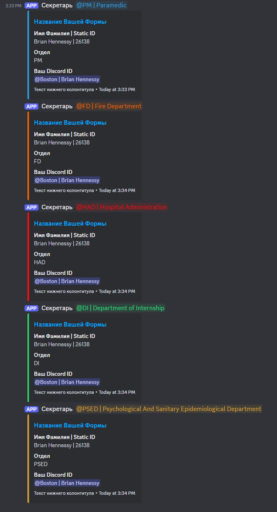

# Google Forms в Discord Webhook

_Читать на других языках: [English](README.en.md), [Русский](README.md)_

Этот скрипт Google Apps автоматически пересылает ответы из Google Forms в канал Discord с помощью вебхуков. Он форматирует ответы в аккуратные эмбеды и может упоминать определенные роли на основе ответов формы, с поддержкой настраиваемых цветов эмбедов, внешнего вида вебхука и временных меток.

## Возможности

Основные функции:
- 📝 Автоматическая обработка ответов Google Forms
- 📨 Отправка отформатированных эмбедов в Discord
- 👥 Упоминание соответствующих ролей на основе выбора отдела

Конфигурация содержимого сообщений:
- 🔄 Поддержка динамического и статического режимов контента
  - Динамический: Автоматически генерирует упоминания на основе выбора отдела
  - Статический: Использует предопределенный текст для всех сообщений
- 👥 Настраиваемая система упоминания ролей:
  - Упоминания кураторов
  - Упоминания руководителей
  - Упоминания заместителей руководителей
- 📝 Поддержка пользовательского статического текста

Форматирование сообщений:
- ↔️ Обработка длинных ответов путем разделения их на несколько полей
- 📑 Автоматическое разделение больших ответов на несколько эмбедов (максимум 25 полей на эмбед)
- 🔍 Автоматическая фильтрация пустых ответов
- 🆔 Форматирование Discord ID в корректные упоминания
- ⏰ Опциональное отображение временных меток в эмбедах
- 🤖 Настраиваемое имя и аватар вебхук-бота
- 📎 Максимум 10 эмбедов на сообщение для больших ответов

Структура сообщений:
- 📊 Умное разделение сообщений с автоматическим управлением полями
- 📑 Соблюдение лимитов Discord (25 полей на эмбед, максимум 10 эмбедов)
- 🔀 Интеллектуальное распределение полей между эмбедами
- 📝 Определенный порядок упоминаний (Куратор -> Руководитель -> Зам.руководителя)
- ✂️ Автоматическое обрезание контента
- 🚫 Умная обработка пустого контента

Визуальная настройка:
- 🎨 Поддержка как специфичных для ролей, так и общих цветов эмбедов
- 🔄 Автоматическая конвертация форматов цветов (HEX в десятичный формат Discord)
- 🖼️ Поддержка изображений в эмбедах
- 👣 Настраиваемый текст и иконка нижнего колонтитула
- 🎯 Автоматическая настройка цвета текста (черный/белый) в зависимости от цвета фона
- 📌 Настраиваемые заголовки для каждого эмбеда
- 🔗 Поддержка URL-ссылок в эмбедах

Обработка ошибок и логирование:
- 📝 Подробное логирование в консоль для отладки
- 🔍 Пошаговое логирование процесса
- ⚠️ Система предупреждений при превышении количества полей
- 🔒 Валидация кодов ответа (проверка на 204)
- 📊 Логирование стека ошибок
- ⚡ Специфичная обработка ответов вебхука

## Настройка

### 1. Настройка Discord

1. В вашем Discord сервере перейдите в Настройки сервера > Интеграции > Вебхуки
2. Создайте новый вебхук или используйте существующий
3. Скопируйте URL вебхука
4. Обновите `webhookUrl` в `config.gs`

### 2. Настройка Google Forms

1. Создайте новую форму Google или откройте существующую
2. Перейдите в редактор скриптов (Расширения > Apps Script)
3. Создайте следующие файлы и скопируйте соответствующий код:
   - `config.gs`
   - `roles.gs`
   - `colors.gs`
   - `utils.gs`
   - `main.gs`
4. Сохраните все файлы

### 3. Конфигурация

#### Основная конфигурация

Скрипт теперь автоматически получает URL вашей формы. Обновите следующие настройки в `config.gs`:

```javascript
const CONFIG = initializeConfig();

function initializeConfig() {
  const activeForm = FormApp.getActiveForm();
  const formUrl = activeForm.getPublishedUrl();

  return {
    discord: {
      webhookUrl: "ВАШ_URL_ВЕБХУКА",        // URL вашего Discord вебхука
      username: "Имя бота",                  // Настраиваемое имя для бота вебхука
      avatarUrl: "",                         // Опционально: URL аватара для бота вебхука
      embed: {
        title: "Название Вашей Формы",       // Заголовок, отображаемый вверху эмбеда Discord
        color: {
          useRoleColors: true,               // true для использования цветов отделов, false для общего цвета
          defaultColor: "#7289DA",           // Цвет по умолчанию/общий цвет в HEX формате
        },
        url: formUrl,                        // Автоматически устанавливается как URL вашей формы
        imageUrl: "",                        // Опционально: URL изображения для включения в эмбед
        footerText: "Текст нижнего колонтитула", // Текст, отображаемый внизу эмбеда
        showTimestamp: true,                 // true для отображения временной метки в эмбедах
      },
      content: {
        mode: "dynamic",                     // Может быть "static" или "dynamic". Static использует фиксированный текст, dynamic использует упоминания
        staticText: "",                      // Фиксированный текст для использования в режиме "static"
        includeMentions: {                   // Настройка упоминаемых ролей в динамическом режиме
          depHead: true,                     // Включать ли упоминания заместителей руководителей отделов
          head: true,                        // Включать ли упоминания руководителей
          curator: false                     // Включать ли упоминания кураторов
        }
      }
    },
    form: {
      multipleChoiceQuestionName: "Отдел",   // Заголовок вопроса для определения упоминаемых ролей
      discordIdIdentifier: "Discord ID",     // Заголовок вопроса, содержащий Discord ID для форматирования как упоминание
    },
  };
}
```

#### Настройка контента сообщений

Скрипт поддерживает два режима для содержимого сообщений:

1. **Динамический режим**: Автоматически упоминает соответствующие роли на основе выбора отдела
   ```javascript
   content: {
     mode: "dynamic",
     staticText: "",
     includeMentions: {
       depHead: true,  // Включить упоминания заместителей начальника
       head: true,     // Включить упоминания начальников
       curator: false  // Включить упоминания кураторов
     }
   }
   ```

2. **Статический режим**: Использует фиксированный текст вместо упоминаний ролей
   ```javascript
   content: {
     mode: "static",
     staticText: "Новая заявка получена!",
     includeMentions: {} // Игнорируется в статическом режиме
   }
   ```

#### Конфигурация ролей

Обновите ID ролей и цвета в `roles.gs` в соответствии с ролями вашего Discord сервера:

```javascript
const ROLES = {
  DEPARTMENT_NAME: {
    roleId: "role_id",
    curatorRoleId: "curator_role_id",
    headRoleId: "head_role_id",
    depHeadRoleId: "dep_head_role_id",
    embedColor: "#HEX_COLOR",
  },
  // Добавьте больше отделов при необходимости
};
```

### 5. Настройка Цветов

#### Режимы цветов

Скрипт поддерживает два режима цветов:

1. **Цвета для конкретных ролей**: Каждый отдел/роль может иметь свой собственный цвет эмбеда
2. **Общий цвет**: Все эмбеды используют один и тот же цвет

Для переключения между режимами обновите флаг `useRoleColors` в `config.gs`:

```javascript
color: {
  useRoleColors: true,  // true для цветов ролей, false для общего цвета
  defaultColor: "#7289DA"  // Используется когда useRoleColors false или роль не выбрана
}
```

#### Использование утилит для работы с цветами

Скрипт включает утилиты для работы с цветами в `colors.gs`:

```javascript
// Конвертация HEX в десятичный цвет Discord
const decimalColor = ColorUtils.hexToDecimal("#FF0000");
```

### 6. Настройка триггера

1. В редакторе Apps Script нажмите на "Триггеры" (значок часов на боковой панели)
2. Нажмите "+ Добавить триггер"
3. Настройте триггер:
   - Выберите функцию: `onSubmit`
   - Выберите источник события: "Из формы"
   - Выберите тип события: "При отправке формы"
4. Нажмите "Сохранить"
5. Предоставьте необходимые разрешения при запросе

## Использование

Скрипт автоматически срабатывает при отправке формы. Каждый ответ будет:

1. Создавать эмбед Discord с ответами формы
2. Форматировать Discord ID как упоминания
3. Упоминать соответствующие роли отделов на основе выбора отдела
4. Применять соответствующий цвет на основе настроек режима цветов
5. Обрабатывать длинные ответы, разделяя их на несколько полей
6. Включать временную метку и нижний колонтитул
7. Автоматически разделять большие ответы на несколько эмбедов (до 10)
8. Пропускать пустые ответы
9. Настраивать цвет текста в зависимости от фона для оптимальной читаемости

## Пример вывода в Discord



## Обработка ошибок

Скрипт включает комплексную обработку следующих ошибок:

- Некорректные ответы формы
- Сбои вебхука Discord
- Проблемы форматирования сообщений
- Ошибки упоминания ролей
- Ошибки валидации конфигурации
- Проблемы получения URL формы
- Переполнение количества полей
- Валидация кодов ответа
- Обработка пустых или null значений

Все ошибки и предупреждения логируются в консоль Apps Script для отладки, включая:
- Подробные логи процесса
- Стеки ошибок
- Предупреждающие сообщения
- Коды ответов
- Статус обработки полей

## Устранение неполадок

Если сообщения не отправляются:

1. Проверьте логи выполнения в Apps Script:
   - Откройте редактор скриптов
   - Перейдите в меню "Вид" > "Логи выполнения"
   - Проверьте наличие детальных сообщений об ошибках

2. Проверьте вебхук Discord:
   - Убедитесь, что URL вебхука корректен
   - Проверьте, не был ли удален вебхук
   - Попробуйте создать новый вебхук и обновить URL в конфигурации

3. Проверьте настройку триггера:
   - Убедитесь, что триггер правильно настроен
   - Проверьте, что все необходимые разрешения предоставлены
   - При необходимости удалите и создайте триггер заново

4. Проверьте настройку ролей:
   - Убедитесь, что ID ролей корректны
   - Проверьте существование всех указанных ролей на сервере
   - Проверьте права доступа вебхука для упоминания ролей

5. Проверьте ограничения Discord:
   - Убедитесь, что количество полей не превышает 25 на эмбед
   - Проверьте, что количество эмбедов не превышает 10
   - Проверьте общий размер сообщения (не более 6000 символов)

## Как внести свой вклад

1. Сделайте форк репозитория
2. Создайте новую ветку для вашей функции
3. Зафиксируйте ваши изменения
4. Создайте pull request

## Лицензия

MIT License - вы можете свободно использовать и модифицировать код по своему усмотрению.

## Авторство

Создано и поддерживается JellyColonel (Discord: jellycolonel)

## Поддержка

По вопросам и предложениям создавайте issue в GitHub репозитории.