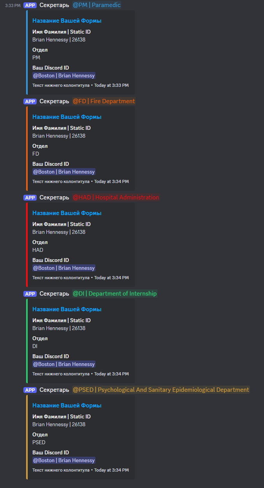

# Google Forms в Discord Webhook

_Читать на других языках: [English](README.en.md), [Русский](README.md)_

Этот скрипт Google Apps автоматически пересылает ответы из Google Forms в канал Discord с помощью вебхуков. Он форматирует ответы в аккуратные эмбеды и может упоминать определенные роли на основе ответов формы, с поддержкой настраиваемых цветов эмбедов, внешнего вида вебхука и временных меток.

## Возможности

Основные возможности:
- 📝 Автоматическая обработка ответов Google Forms
- 📨 Отправка отформатированных эмбедов в Discord
- 👥 Упоминание соответствующих ролей на основе выбора отдела

Форматирование сообщений:
- ↔️ Обработка длинных ответов путем разделения их на несколько полей
- 🆔 Форматирование Discord ID в правильные упоминания
- ⏰ Опциональное отображение временной метки в эмбедах
- 🤖 Настраиваемое имя и аватар бота вебхука
- 📋 Настраиваемые заголовки и описания полей формы

Визуальная настройка:
- 🎨 Поддержка как уникальных цветов для ролей, так и общего цвета
- 🔄 Автоматическая конвертация форматов цветов (HEX в десятичный формат Discord)
- 🖼️ Поддержка изображений в эмбедах
- 👣 Настраиваемый текст нижнего колонтитула

Технические возможности:
- 🔗 Автоматическая настройка URL формы
- ⚙️ Валидация конфигурации при запуске
- ⚠️ Включает обработку ошибок и логирование
- 🔒 Встроенная валидация Discord ID с помощью регулярных выражений
- 🔄 Автоматическая синхронизация вариантов выбора отдела с конфигурацией

## Настройка

### 1. Настройка Discord

1. В вашем Discord сервере перейдите в Настройки сервера > Интеграции > Вебхуки
2. Создайте новый вебхук или используйте существующий
3. Скопируйте URL вебхука
4. Обновите `webhookUrl` в `config.gs`

### 2. Настройка Google Forms

1. Создайте новую форму Google или откройте существующую
2. Перейдите в редактор скриптов (Расширения > Apps Script)
3. Создайте следующие файлы и скопируйте соответствующий код:
   - `config.gs`
   - `roles.gs`
   - `colors.gs`
   - `utils.gs`
   - `main.gs`
   - `form-setup.gs`
4. Сохраните все файлы

### 3. Конфигурация

#### Основная конфигурация

Скрипт теперь автоматически получает URL вашей формы. Обновите следующие настройки в `config.gs`:

```javascript
const CONFIG = initializeConfig();

function initializeConfig() {
  const activeForm = FormApp.getActiveForm();
  const formUrl = activeForm.getPublishedUrl();

  return {
    discord: {
      webhookUrl: "ВАШ_URL_ВЕБХУКА",        // URL вашего Discord вебхука
      username: "Имя бота",                  // Настраиваемое имя для бота вебхука
      avatarUrl: "",                         // Опционально: URL аватара для бота вебхука
      embed: {
        title: "Название Вашей Формы",       // Заголовок, отображаемый вверху эмбеда Discord
        color: {
          useRoleColors: true,               // true для использования цветов отделов, false для общего цвета
          defaultColor: "#7289DA",           // Цвет по умолчанию/общий цвет в HEX формате
        },
        url: formUrl,                        // Автоматически устанавливается как URL вашей формы
        imageUrl: "",                        // Опционально: URL изображения для включения в эмбед
        footerText: "Текст нижнего колонтитула", // Текст, отображаемый внизу эмбеда
        showTimestamp: true,                 // true для отображения временной метки в эмбедах
      },
    },
    form: {
      title: "Название формы",               // Заголовок вашей Google формы
      description: "Описание формы",         // Текст описания вашей Google формы
      multipleChoiceQuestionName: "Отдел", // Заголовок вопроса, используемый для определения упоминаемых ролей
      discordIdIdentifier: "Discord ID",     // Заголовок вопроса, содержащий Discord ID для форматирования как упоминание
    },
  };
}
```

#### Конфигурация ролей

Обновите ID ролей и цвета в `roles.gs` в соответствии с ролями вашего Discord сервера:

```javascript
const ROLES = {
  DEPARTMENT_NAME: {
    roleName: "Department Name",
    roleId: "role_id",
    curatorRoleId: "curator_role_id",
    headRoleId: "head_role_id",
    depHeadRoleId: "dep_head_role_id",
    embedColor: "#HEX_COLOR",
  },
  // Добавьте больше отделов при необходимости
};
```

### 4. Настройка и Валидация Формы

1. В редакторе Apps Script создайте новый файл `form-setup.gs`
2. Скопируйте предоставленный код настройки в файл
3. Запустите функцию `setupForm()` для настройки формы:
   - Настройка валидации Discord ID (регулярное выражение: `^\d{17,19}$`)
   - Настройка вариантов выбора отдела на основе ROLES
   - Установка заголовка и описания формы

Для обновления валидации формы позже:
- Запустите `setupFormValidation()` чтобы обновить только правила валидации
- Запустите `resetFormValidation()` если нужно удалить все валидации
- Запустите `setupForm()` для полной настройки формы

Примечание: Не забудьте повторно запустить эти функции настройки, если вы:
- Вносите изменения в конфигурацию ROLES
- Изменяете структуру формы
- Нуждаетесь в обновлении правил валидации

### 5. Настройка Цветов

#### Режимы цветов

Скрипт поддерживает два режима цветов:

1. **Цвета для конкретных ролей**: Каждый отдел/роль может иметь свой собственный цвет эмбеда
2. **Общий цвет**: Все эмбеды используют один и тот же цвет

Для переключения между режимами обновите флаг `useRoleColors` в `config.gs`:

```javascript
color: {
  useRoleColors: true,  // true для цветов ролей, false для общего цвета
  defaultColor: "#7289DA"  // Используется когда useRoleColors false или роль не выбрана
}
```

#### Использование утилит для работы с цветами

Скрипт включает утилиты для работы с цветами в `colors.gs`:

```javascript
// Конвертация HEX в десятичный цвет Discord
const decimalColor = ColorUtils.hexToDecimal("#FF0000");
```

### 6. Настройка триггера

1. В редакторе Apps Script нажмите на "Триггеры" (значок часов на боковой панели)
2. Нажмите "+ Добавить триггер"
3. Настройте триггер:
   - Выберите функцию: `onSubmit`
   - Выберите источник события: "Из формы"
   - Выберите тип события: "При отправке формы"
4. Нажмите "Сохранить"
5. Предоставьте необходимые разрешения при запросе

## Использование

Скрипт автоматически срабатывает при отправке формы. Каждый ответ будет:

1. Создавать эмбед Discord с ответами формы
2. Форматировать Discord ID как упоминания
3. Упоминать соответствующие роли отделов на основе выбора отдела
4. Применять соответствующий цвет на основе настроек режима цветов
5. Обрабатывать длинные ответы, разделяя их на несколько полей
6. Включать временную метку и нижний колонтитул

## Пример вывода в Discord



## Обработка ошибок

Скрипт включает обработку следующих ошибок:

- Некорректные ответы
- Сбои вебхука Discord
- Проблемы форматирования сообщений
- Ошибки упоминания ролей
- Ошибки валидации конфигурации
- Проблемы получения URL формы

Все ошибки логируются в консоль Apps Script для отладки.

## Устранение неполадок

Если сообщения не отправляются:
1. Проверьте логи выполнения в Apps Script на наличие детальных сообщений об ошибках
2. Убедитесь, что URL вебхука корректен и вебхук не был удален
3. Проверьте, что триггер правильно настроен и авторизован
4. Подтвердите, что заголовки вопросов формы соответствуют вашей конфигурации
5. Проверьте, что ID ролей корректны и роли все еще существуют на вашем сервере

## Как внести свой вклад

1. Сделайте форк репозитория
2. Создайте новую ветку для вашей функции
3. Зафиксируйте ваши изменения
4. Создайте pull request

## Лицензия

MIT License - вы можете свободно использовать и модифицировать код по своему усмотрению.

## Авторство

Создано и поддерживается JellyColonel (Discord: jellycolonel)

## Поддержка

По вопросам и предложениям создавайте issue в GitHub репозитории.